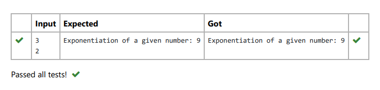

# Find the exponentiation of a number

## AIM:
To write a program to find the exponentiation of a number.

## Equipments Required:
1. Hardware – PCs
2. Anaconda – Python 3.7 Installation / Moodle-Code Runner

## Algorithm
### Step 1. Get the input from the user.
### Step 2. Use exponentiation operator to find the exponentiation of a number.

## Program:
```
n1=int(input())
n2=int(input())
print('Exponentiation of a given number:',n1**n2)
```

## Output:



## Result:
Thus the program to find the exponentiation of a given number is written and verified using python programming.
